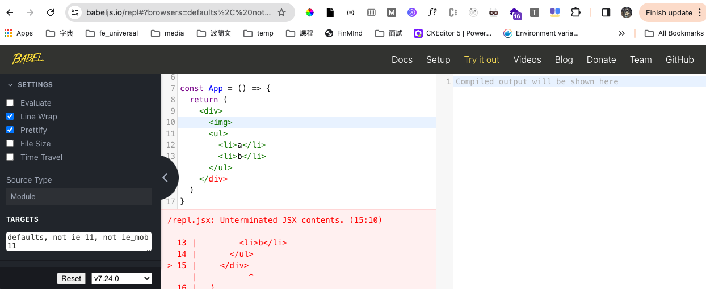
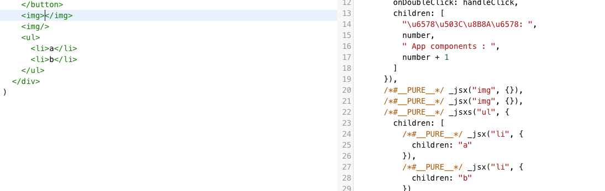
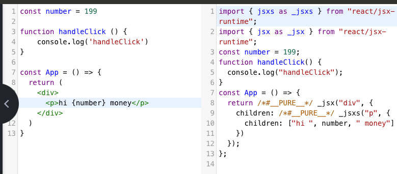
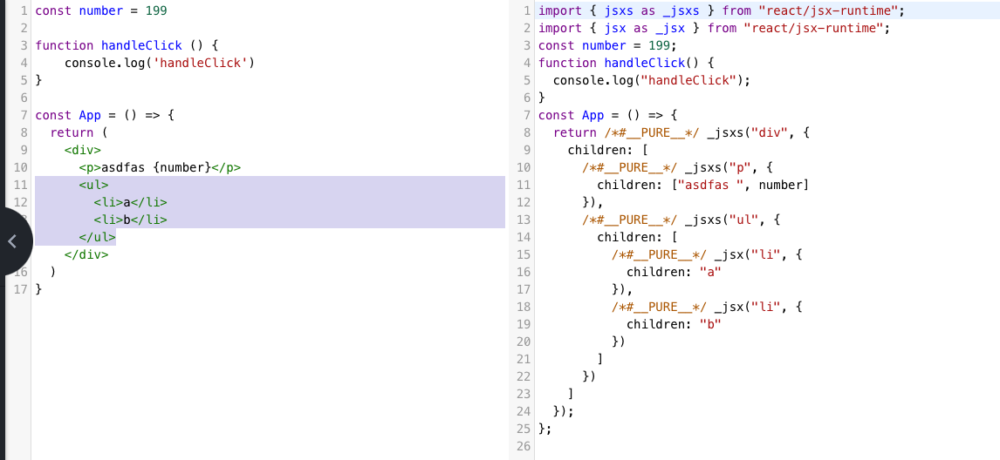

> TAG:: #React #JSX 

> [JSX 根本就不是在 JavaScript 中寫 HTML](./2-4JSX%20根本就不是在%20JavaScript%20中寫%20HTML.md)

> JSX it's just to translate those HTML tags into React.createElement calls.

為了支援更多 JavaScript 程式碼中的邏輯以及各種資料型別的表達，JSX 勢必需要有一些嚴謹的格式及規則，以下說明相關語法規則...

# 嚴格標籤閉合
## HTML
🔸 在 HTML 中有「空元素」的標籤，此類型的標籤是不需要閉合的，如 `<br>` 、``、`<input>`等。這些標籤不會包含任何內容或子元素。
``` HTML

<input type="text">
```

在HTML中，若需要閉合的標籤，即使開發時遺漏了閉合標籤，瀏覽器的 HTML 解析器也會因為具有容錯性，而不會出錯。
此情境下，瀏覽器會嘗試推斷結構，並建立畫面的 DOM element。

## JSX
對比 HTML，JSX 語法是==嚴格閉合==的。若標籤沒有正確的閉合，JSX transformer 就會沒辦法正確解析 React.createElement方法呼叫位置與層級，進而產生轉譯失敗。


即便在 HTML 中是空元素的 `<br>` 、``、`<input>` 也需要寫閉合標籤，寫法可以有自我閉合或是獨立閉合標籤兩種形式 - ex: `<br/>` 或 `<br></br>`; 這樣的寫法 JSX 會自動忽略不填用於指定元素的第三個參數。


# JSX 語法中的資料表達

**What is HTML**
#HTML 語法是**純字串格式**的一段靜態文字組成的標籤語言，除了表示`標籤結構` 和 `固定字串`外，並不具備有邏輯運算或資料型別，更無法有表達式概念

**What is JSX**
JSX 語法在轉譯後實際上是**一段可執行的 JavaScript 程式碼**，所以可以表達資料型別，也可以使用各種表達式。


## 固定的字串字面值
此需求也是是 HTML能處理的範圍
``` jsx
%% input  %%
const div = (
<div className="bar">
字串
</div>
)
```

``` js
%% output.js %%
const div = React.createElement(
 'div',
 {
  className: 'bar'
 },
 '字串'
)
```
**情境**
- 在指定屬性值時標達字串字面值: `className="bar"`
- 在指定子元素時表達字串自面值: `上述的字串`

## 表達式
需要搭配 `{}` 將表達式包住

**情境**
- 在指定屬性值時表達一段表達式: `onClick={handleButtonClick}`
- 在指定子元素置放表達式 : `<div>{children}</div>`

**注意：**
當子元素包含表達式時，每個表達式都會被視為一個獨立的子元素，並且會讓前面的字串被切分開來成為獨立的子元素




## 另一段JSX 語法作為子元素
拗口的唸法就是在一段 `React.createElement`方法的呼叫中，包含另一段 `React.createElement`方法的呼叫來作為子元素。



## React element 的子元素的支援型別

當我們定義一個對應 DOM element 類型的 React element，其子元素會根據 ==型別== 的不同，而有不同的方式轉換到實際的 DOM element中。

### 轉換時，各型別處理行為
#### React element
直接轉換為對應結構的實際 DOM element
#### 字串值
直接印出
#### 數字值
轉成字串型別後直接印出
#### 布林、null、undefined
什麼都不印，直接被忽略而不會出現在實際的DOM element中
此技巧常會應用在條件式判斷渲染
#### 陣列
攤開成多個子元素後依序全部印出
#### 物件、函式
 ❗️ 無法作為子元素轉換到實際DOM element中印出，會發生錯誤

# 畫面渲染邏輯
因應不同資料或狀態而有不同的渲染邏輯，其中以「動態列表渲染」和「條件式判斷渲染」是較為常見情境

## 動態列表渲染

承接上面所述React 對於陣列型別的子元素，會進行攤開處理，並依序渲染，而此特性常用於動態產生列表的畫面

> 因效能優化，務必記得要在動態的 Element加上不重複的 key

>Keys tell React which array item each component corresponds to, so that it can match them up later. This becomes important if your array items can move (e.g. due to sorting), get inserted, or get deleted. A well-chosen `key` helps React infer what exactly has happened, and make the correct updates to the DOM tree.
>- [Rendering-lists 官網](https://react.dev/learn/rendering-lists)

## 條件式渲染
依據資料或條件決定是否要渲染特定的畫面

**1. 透過 if / else**
**2. 透過&&運算子**
透過此表達式預期要達到符合條件渲染，不符合則不印 ; 
要記得 && 運算子的本身是依據 `truthy`，所若是非 布林、null、undefined 就要小心處理，否則會印出來

```
const foo = false // 若是非 布林、null、undefined 就要小心處理，否則會印出來
const ha = 0
const element = (
	<div>
		{ foo && <h1>xxx</h1>} // 不印
		{ ha && <h1>xxx</h1>} // 印出 0
	</div>
)
```

**3.透過三元運算子 **

# 為什麼一段 JSX 語法的第一層只能有一個節點

**不合法的JSX**
```
const element = (
  <div>d</div>
  <div>d</div>
)
```

一段 JSX 其實就是在呼叫一次的 **React.createElement**，它僅會回傳一個 React element 做為結果。
換一句話說樹狀結構只能有一個根節點，所以要讓不合法的 JSX 只需要再包一個父層。

```
const element = (
<>
  <div>d</div>
  <div>d</div>
</>
)

```

## Fragment
以上述例子為例，若父層以 `<div></div>` 包夾，即會產生不想要的 div，所以 React 提供的一個特殊元素稱 `Fragment` / `<>`，用途將同層級的多個 React element 作為子元素包起來，但又不會渲染至瀏覽器


# 回顧
JSX 語法與 HTML 語法有哪些不同之處？
**標籤閉合的嚴格性**
在JSX中，所有的標籤都一定要有閉合，不論是透過 `自我閉合 (self-closing tag)`(例如：``)，或是成對的開啟閉合標籤(例如: `<div></div>`)

而空元素(如``) 在HTML是可運行，甚至有時失誤忘了寫閉合標籤，瀏覽器也會嘗試推斷結構，並建立畫面的 DOM element。

**使用表達式要用 {}**
JSX 語法在轉譯後實際上是**一段可執行的 JavaScript 程式碼**，所以可以表達資料型別，也可以使用各種表達式。

**屬性名稱的差異**
JSX 基於 React element 對屬性命名的規範，所以像 class 要寫成 className 等


**為什麼一段 JSX 語法的第一層只能有一個節點？**
JSX 本質是呼叫一次 `React.createElement`回傳一個 React element ，其只能接受一個元素類型、屬性及子元素。
可以以樹狀結構去想像及思考; 所以想要讓放置在同層級的多個 React element可運行，只需要再包一個父層;
父層可以是透過一般 tag 或 React 提供特殊的 Fragment。
